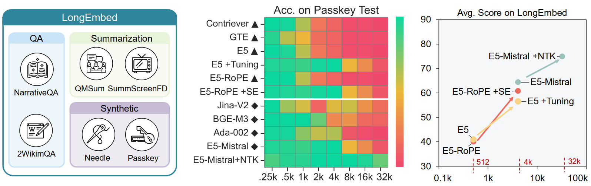

<!-- # LongEmbed: Extending Embedding Models for Long Context Retrieval -->
# <div align="center">LongEmbed</div>
##  <div align="center">Extending Embedding Models for Long Context Retrieval</div>

<div align="center">Dawei Zhu, Liang Wang, Nan Yang, Yifan Song, Wenhao Wu, Furu Wei, Sujian Li
<br><br>

[Please see full details in our pre-print](assets/LongEmbed_v0417.pdf)
</div> 
<div align="center">
<a href=""></a>
<a href="https://huggingface.co/datasets/dwzhu/LongEmbed"></a>
<a href="https://huggingface.co/dwzhu/e5rope-base"></a>
</div>

This repository is the official implementation for the paper "LongEmbed: Extending Embedding Models for Long Context Retrieval"

This paper explores context window extension of existing embedding models, pushing the limit to 32k without requiring additional training. We have constructed the LongEmbed benchmark for long context retrieval, and investigates various methods to increase the input length of current embedding models.



## ⚡Released Models

To facilitate future research in long context embedding models, we release E5-Base-4k and E5-RoPE-Base. E5-Base-4k is further fine-tuned on E5-Base to support 4k context, while strictly preserving original behavior for inputs not exceeding 512 tokens. E5-RoPE-Base follows the same training procedure as E5-Base, except for the substitution of APE with RoPE. It is released to facilitate comparison between APE \& RoPE-Based embedding models.

| Model | Link |
| --- | --- |
| E5-Base-4k | [Download Link](https://huggingface.co/dwzhu/e5-base-4k) |
| E5-RoPE-Base | [Download Link](https://huggingface.co/dwzhu/e5rope-base) |

Note that E5-Base-4k simply expands the position embedding matrix to allow for 4,096 position ids. The embedding vectors for the original pids {0,1,2,...,511} is mapped to represent {0,8,16,...,4088}. Embedding vectors for other pids are trained. So for inputs not exceeding 512 tokens, please multiply the position ids by 8 to maintain the original behavior. 

## 🔍 Overview of LongEmbed

### Task Description

LongEmbed includes 4 real-world retrieval tasks curated from long-form QA and summarization. Note that for QA and summarization datasets, we use the questions and summaries as queries, respectively.

- [NarrativeQA](https://huggingface.co/datasets/narrativeqa): A QA dataset comprising long stories averaging 50,474 words and corresponding questions about specific content such as characters, events. We adopt the `test` set of the original dataset.
- [2WikiMultihopQA](https://huggingface.co/datasets/THUDM/LongBench/viewer/2wikimqa_e): A multi-hop QA dataset featuring questions with up to 5 hops, synthesized through manually designed templates to prevent shortcut solutions. We use the `test` split of the length-uniformly sampled version from [LongBench](https://huggingface.co/datasets/THUDM/LongBench).
- [QMSum](https://huggingface.co/datasets/tau/scrolls/blob/main/qmsum.zip): A query-based meeting summarization dataset that requires selecting and summarizing relevant segments of meetings in response to queries. We use the version processed by [SCROLLS](https://huggingface.co/datasets/tau/scrolls). Since its test set does not include ground truth summarizations, and its validation set only have 60 documents, which is too small for document retrieval, we include the `train` set in addition to the `validation` set.
- [SummScreenFD](https://huggingface.co/datasets/tau/scrolls/blob/main/summ_screen_fd.zip): A screenplay summarization dataset comprising pairs of TV series transcripts and human-written summaries. Similar to QMSum, its plot details are scattered throughout the transcript and must be integrated to form succinct descriptions in the summary. We use `validation` set of the version processed by [SCROLLS](https://huggingface.co/datasets/tau/scrolls).

We also include two synthetic tasks, namely needle and passkey retrieval. The former is tailored from the [Needle-in-a-Haystack Retrieval](https://github.com/gkamradt/LLMTest_NeedleInAHaystack) for LLMs. The later is adopted from [Personalized Passkey Retrieval](https://huggingface.co/datasets/intfloat/personalized_passkey_retrieval), with slight change for the efficiency of evaluation. The advantage of synthetic data is that we can flexibly control context length and distribution of target information. For both tasks, we evaluate a broad context range of $\{0.25,0.5,1,2,4,8,16,32\}\times1024$ tokens. For each context length, we include 50 test samples, each comprising 1 query and 100 candidate documents.


### Task Statistics

| Dataset | Domain | # Queries | # Docs | Avg. Query Words | Avg. Doc Words |
|---------|--------|-----------|--------|------------------|----------------|
| NarrativeQA | Literature, File | 10,449 | 355 | 9 | 50,474 |
| QMSum | Meeting | 1,527 | 197 | 71 | 10,058 |
| 2WikimQA | Wikipedia | 300 | 300 | 12 | 6,132 |
| SummScreenFD | ScreenWriting | 336 | 336 | 102 | 5,582 |
| Passkey | Synthetic | 400 | 800 | 11 | - |
| Needle | Synthetic | 400 | 800 | 7 | - |

## 📈 Evaluation on the LongEmbed Benchmark

### Environment Setup

To replicate our results, follow these steps to download the code and necessary dependencies:
```
git clone https://github.com/dwzhu-pku/LongEmbed.git
cd LongEmbed
pip install -r requirements.txt
```

### Loading Data
LongEmbed contains six datasets: NarrativeQA, QMSum, 2WikiMultihopQA, SummScreenFD, Passkey, and Needle. Each dataset has three splits: corpus, queries, and qrels. The `corpus.jsonl` file contains the documents, the `queries.jsonl` file contains the queries, and the `qrels.jsonl` file describes the relevance. To specific split of load each dataset, you may use:

```python
from datasets import load_dataset
# dataset_name in ["narrativeqa", "summ_screen_fd", "qmsum", "2wikimqa", "passkey", "needle"]
# split_name in ["corpus", "queries", "qrels"]
data_list = load_dataset(path="dwzhu/LongEmbed", name="dataset_name", split="split_name")
```

### Evaluation

The evaluation of LongEmbed can be easily conducted using MTEB. For the four real tasks, you can evaluate as follows:

```python
from mteb import MTEB
retrieval_task_list = ["LEMBSummScreenFDRetrieval", "LEMBQMSumRetrieval","LEMBWikimQARetrieval","LEMBNarrativeQARetrieval"]
output_dict = {}
evaluation = MTEB(tasks=retrieval_task_list)
#TODO load the model before evaluation
results = evaluation.run(model,output_folder=args.output_dir, overwrite_results=True, batch_size=args.batch_size,verbosity=0)
for key, value in results.items():
	split = "test" if "test" in value else "validation"
	output_dict[key] = {"ndcg@1": value[split]["ndcg_at_1"], "ndcg@10": value[split]["ndcg_at_10"]}
print(output_dict)
```

For the two synthetic tasks, we examine a broad context range of {256, 512, 1024, 2048, 4096, 8192, 16384, 32768} tokens. You may evaluate as follows:

```python
from mteb import MTEB
needle_passkey_task_list = ["LEMBNeedleRetrieval", "LEMBPasskeyRetrieval"]
output_dict = {}
context_length_list = [256, 512, 1024, 2048, 4096, 8192, 16384, 32768]
evaluation = MTEB(tasks=needle_passkey_task_list)
#TODO load the model before evaluation
results = evaluation.run(model, output_folder=args.output_dir, overwrite_results=True,batch_size=args.batch_size,verbosity=0)
for key, value in results.items():
	needle_passkey_score_list = []
	for ctx_len in context_length_list:
		needle_passkey_score_list.append([ctx_len, value[f"test_{ctx_len}"]["ndcg_at_1"]])
	needle_passkey_score_list.append(["avg", sum([x[1] for x in needle_passkey_score_list])/len(context_length_list)])
	output_dict[key] = {item[0]: item[1] for item in needle_passkey_score_list}
print(output_dict)
```

Our code snippet for evaluation can be found in `src/test_long_embed.py`. You may refer to the scripts in `scripts/run_long_embed.sh` to reproduce the results.


## 🌟 Citation
If you find this repo helpful, please cite our paper as follows:

```bibtex
@article{zhu2024longembed,
  title={LongEmbed: Extending Embedding Models for Long Context Retrieval},
  author={Zhu, Dawei and Wang, Liang and Yang, Nan and Song, Yifan and Wu, Wenhao and Wei, Furu and Li, Sujian},
  journal={arXiv preprint arXiv:2404.12096},
  year={2024}
}
```

